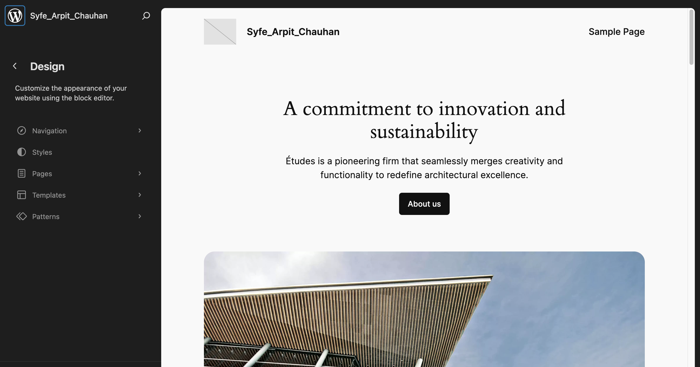
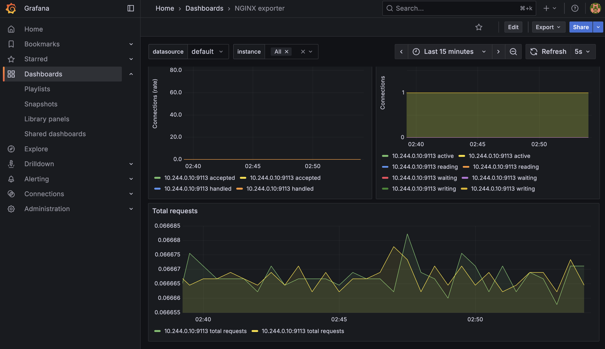
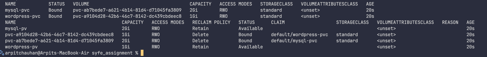
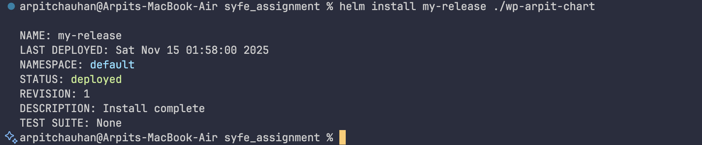
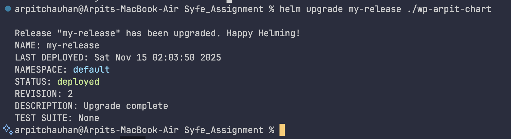
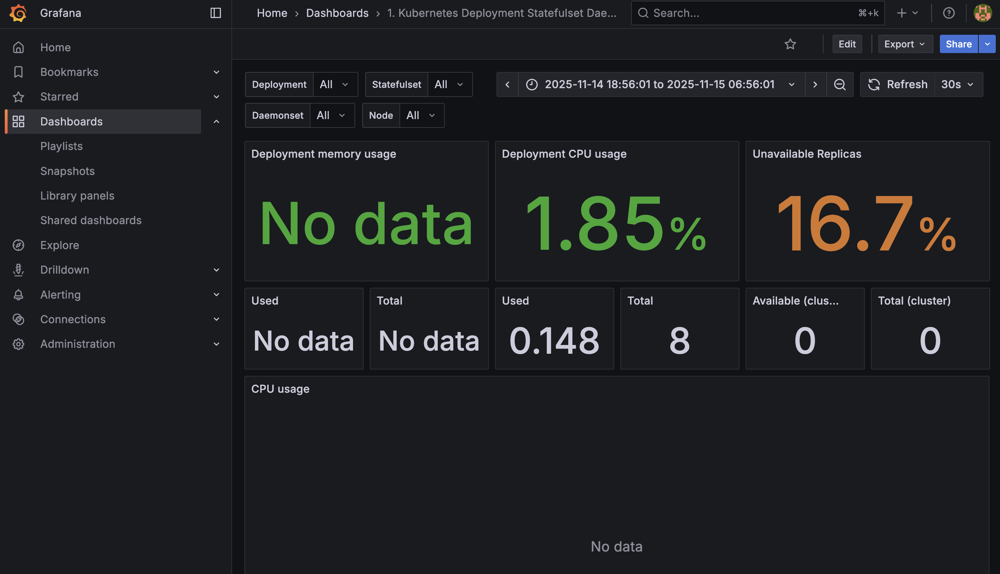
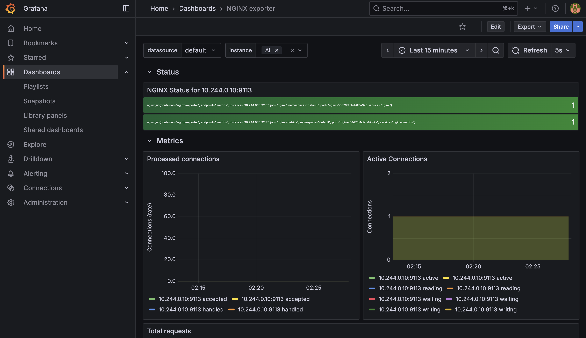

# WordPress-MySQL-Nginx Deployment on Kubernetes with Prometheus and Grafana



**Assignment by Arpit Chauhan**

This project is part of my Kubernetes assignment where I had to containerize a WordPress application, test it locally, deploy it on Minikube using Kubernetes manifests, and finally convert everything into a Helm chart. Later, I also had to integrate monitoring using Prometheus + Grafana and visualize metrics.

Below is the complete breakdown of my work, the flow I followed, and how to run this project.
---

## 🔹 Phase 1: Containerization & Local Testing

### 1. Created Dockerfiles for WordPress, MySQL, and Nginx

The first step was to write individual Dockerfiles for all three services:

| Service | Notes |
|---------|-------|
| WordPress | Simple PHP-Apache WordPress image with basic configuration |
| MySQL | Used custom env variables (user, DB, password) |
| Nginx (OpenResty) | Compiled from source because I needed Lua support for future extensions |

I made sure all containers built successfully:

```bash
cd Dockerfiles/mysql
docker build -t mysql-local:latest .

cd ../nginx
docker build -t nginx-local:latest .

cd ../wordpress
docker build -t wordpress-local:latest .
```

### 2. Tested Everything Using Docker Compose

Before going to Kubernetes, I validated my setup with a simple `docker-compose.yml`. This is the easiest way to verify whether WordPress can talk to MySQL and whether Nginx can forward requests to it.

After running:

```bash
docker compose up --build
```

I checked:
- WordPress opens in the browser
- Database initializes correctly
- Nginx `proxy_pass` → WordPress works

Once everything worked locally, I moved to Kubernetes.

---

## 🔹 Phase 2: Kubernetes Manifests on Minikube

### 3. Wrote Manual Kubernetes Manifests Before Helm

Before jumping into Helm, I wrote raw YAML manifests to fully understand how everything behaves on Kubernetes. I created:

- Deployments
- Services
- Secrets
- PVCs
- PVs
- ConfigMaps

I applied them one by one:

```bash
kubectl apply -f mysql/
kubectl apply -f wordpress/
kubectl apply -f nginx/
```


### 4. Persistent Volumes (Including NFS)



Initially, I experimented with:
- **RWX volumes using an NFS server inside Minikube**
- Deployed NFS provisioner
- Tested multi-pod access

But to keep the final setup simple and clean for evaluation, I used:
- **RWO PVCs for MySQL and WordPress**

The RWX/NFS part is not the focus but I still explored it to understand storage flexibility.

### 5. Verified Everything on Minikube

Before creating the Helm chart, I made sure the entire stack worked manually.

Commands I used repeatedly:

```bash
kubectl get pods
kubectl get svc
kubectl get pvc
```

Once WordPress started successfully and I logged in from the browser, I finalized that my YAMLs were correct.

---

## 🔹 Phase 3: Helm Chart Development (personal favorite, most time consuming)

### 6. Studied Helm Structure First

Before creating my own chart, I:
- Watched tutorials on Helm basics
- Cloned and inspected the **Bitnami WordPress Helm chart**

This helped me understand:
- Structure of `templates/`
- `_helpers.tpl` usage
- `values.yaml` patterns
- Best practices in naming & templating

This gave me confidence to build my own chart from scratch.

### 7. Created My Helm Chart

```bash
helm create wp-arpit-chart
```

Then I customized:
- `templates/deployment.yaml`
- `templates/service.yaml`
- `templates/secret.yaml`
- `values.yaml`
- Nginx templates
- PVC templates

The chart deploys WordPress, MySQL, and Nginx together.

### 8. Tested the Chart

**Install:**
```bash
helm install my-release ./wp-arpit-chart
```


**Delete:**
```bash
helm delete my-release
```


Everything deployed correctly — pods running, PVCs bound, WordPress reachable, Nginx proxying.

**This completed Phase 1 of my assignment.**

---

## 🔹 Phase 4: Monitoring with Prometheus & Grafana


### 9. Installed Prometheus & Grafana Using Official Helm Charts

**Prometheus:**
```bash
helm repo add prometheus-community https://prometheus-community.github.io/helm-charts
helm repo update
helm install monitoring prometheus-community/kube-prometheus-stack
```

**Grafana:**
Included in the kube-prometheus-stack installation above.


### 10. Exposed Grafana & Logged In

I used:
```bash
kubectl port-forward svc/monitoring-grafana 3000:80
```

Then browsed to `localhost:3000`.


**Default login:**
- Username: `admin`
- Password: Get with:
  ```bash
  kubectl get secret monitoring-grafana -o jsonpath="{.data.admin-password}" | base64 --decode
  ```

### 11. Added Dashboards

In Grafana:
- **+** → **Import** → Enter ID **8588**
  - Kubernetes Container Metrics (Pod CPU, memory, usage, etc.)
  
- **+** → **Import** → Enter ID **12708**
  - Nginx Prometheus Exporter Dashboard

### 12. Wrote Custom Prometheus Rules

I wrote rules to scrape:
- Nginx Exporter
- Node / Pod metrics
- WordPress / MySQL pod CPU usage

Applied with:
```bash
kubectl apply -f prometheus-rules.yaml
kubectl apply -f servicemonitor.yaml
```

Prometheus started recording & Grafana displayed the graphs.

one is for MySQL server:


this one is for Nginx:



**Screenshots will include:**
- All running pods
- Persistent volumes
- Services
- Grafana dashboards
- Prometheus targets

---

## How to Run This Project

### Prerequisites

- Docker installed
- Minikube running
- kubectl configured
- Helm 3 installed

### Step 1: Clone the Repository

```bash
git clone <repo-url>
cd <repo-directory>
```

### Step 2: Build Docker Images

```bash
# MySQL
cd Dockerfiles/mysql
docker build -t mysql-local:latest .

# Nginx
cd ../nginx
docker build -t nginx-local:latest .

# WordPress
cd ../wordpress
docker build -t wordpress-local:latest .

cd ../..
```

### Step 3: Start Minikube

```bash
minikube start
```

### Step 4: Install Helm Chart

```bash
helm install my-release ./wp-arpit-chart
```

### Step 5: Check Resources

```bash
kubectl get pods
kubectl get svc
kubectl get pvc
kubectl get pv
```

**Expected output:**
```
NAME                         READY   STATUS    RESTARTS   AGE
mysql-xxx                    1/1     Running   0          2m
wordpress-xxx                1/1     Running   0          2m
nginx-xxx                    2/2     Running   0          2m
```

### Step 6: Access WordPress

```bash
# If on local machine
open http://localhost:30081

# Or using minikube
minikube service nginx
```

### Step 7: Install Monitoring (Phase 2)

```bash
helm repo add prometheus-community https://prometheus-community.github.io/helm-charts
helm repo update
helm install monitoring prometheus-community/kube-prometheus-stack
```

Wait for pods to be ready:
```bash
kubectl get pods -w
```

### Step 8: Access Grafana

```bash
kubectl port-forward svc/monitoring-grafana 3000:80
```

Open `http://localhost:3000`

Get password:
```bash
kubectl get secret monitoring-grafana -o jsonpath="{.data.admin-password}" | base64 --decode
echo
```

### Step 9: Apply Monitoring Config

```bash
kubectl apply -f servicemonitor.yaml
kubectl apply -f prometheus-rules.yaml
```

### Step 10: Import Grafana Dashboards

1. In Grafana, click **+** → **Import Dashboard**
2. Enter ID: **12708** (Nginx Exporter)
3. Click **Load** → Select **Prometheus** → **Import**
4. Repeat for ID: **8588** (Kubernetes Pods)

---

## Monitoring Metrics

### Key Metrics Being Tracked

| Component | Metric | Description |
|-----------|--------|-------------|
| **WordPress/MySQL Pods** | CPU utilization | Container CPU usage |
| | Memory usage | Container memory consumption |
| | Pod restarts | Number of restarts |
| **Nginx** | Total requests | HTTP request count |
| | 5xx errors | Server error rate |
| | Active connections | Current connections |
| **General** | Pod status | Running/Failed/Pending |

### Alerts Configured

| Alert Name | Condition | Severity | Action Required |
|------------|-----------|----------|-----------------|
| HighPodCPU | CPU > 80% for 2min | Warning | Scale or optimize |
| PodDown | Pod not Running | Critical | Investigate & restart |
| HighNginx5xxErrors | 5xx rate > 5% | Warning | Check backend services |

---

## Project Structure

```
.
├── Dockerfiles/
│   ├── mysql/
│   │   └── Dockerfile
│   ├── nginx/
│   │   ├── Dockerfile
│   │   └── default.conf
│   └── wordpress/
│       └── Dockerfile
├── wp-arpit-chart/
│   ├── Chart.yaml
│   ├── values.yaml
│   └── templates/
│       ├── mysql-secret.yaml
│       ├── mysql-pv.yaml
│       ├── mysql-pvc.yaml
│       ├── mysql-deployment.yaml
│       ├── wordpress-pv.yaml
│       ├── wordpress-pvc.yaml
│       ├── wordpress-deployment.yaml
│       └── nginx-deployment.yaml
├── servicemonitor.yaml
├── prometheus-rules.yaml
├── METRICS.md
└── README.md
```

---

## Conclusion

This project helped me understand the complete flow from containerizing an application to deploying it on Kubernetes with proper monitoring. The setup demonstrates a production-style WordPress deployment with:

- Custom Docker images
- Kubernetes orchestration
- Helm chart management
- Persistent storage
- Reverse proxy setup
- Full monitoring stack

The final setup is scalable, maintainable, and follows Kubernetes best practices.

---

## Acknowledgments

- Bitnami WordPress Helm chart for reference
- Kubernetes & Helm documentation
- Prometheus & Grafana communities

**Author**: Arpit Chauhan  
**Assignment**: Kubernetes Deployment with Monitoring
